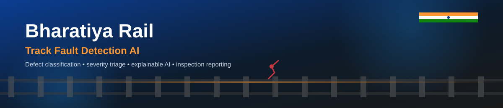

<div align="center">



<br/>

[](https://www.python.org/)
[](https://streamlit.io/)
[](https://www.tensorflow.org/)
[](./LICENSE)
[](#-author--maintainer)

**AI-powered railway track defect detection, severity triage, and official inspection reporting — built for field engineers.**

</div>

---

## 📖 Overview

**Bharatiya Rail — Track Fault Detection AI** is a Streamlit application that lets railway inspection staff upload or capture a photo of a track section and get an instant AI classification of surface defects (**Cracks**, **Flakings**, **Squats**), complete with severity triage, an AI-focus heatmap showing *where* the model based its decision, session analytics, a context-aware assistant, and an official downloadable PDF inspection report.

The system is built around a transfer-learning **EfficientNetB0** classifier and is designed to support — not replace — manual inspection by qualified railway engineering personnel.

---

## ✨ Features

- 🪪 **Staff Intake Portal** — inspector, employee ID, designation, zone, and division captured once per session
- 🧠 **AI Defect Classification** — three-class detection (Cracks · Flakings · Squats) with automatic severity mapping (Low / Medium / High)
- 🎯 **Exact Part Detected (AI Focus Map)** — Grad-CAM heatmap with SmoothGrad and occlusion-sensitivity fallbacks, gated by a **reliability check** so the app never overstates a low-confidence localization as a confirmed defect location
- 📍 **Auto Location Detection** — browser geolocation with reverse-geocoding, editable at any time
- 📈 **Live Analytics Dashboard** — session and cross-user inspection history, severity/defect breakdowns, confidence trends, location heatmaps
- 🤖 **Context-Aware AI Assistant** — answers questions about defect types, severity rules, model metrics, and the current session
- 📄 **Official PDF Inspection Reports** — multi-section report with inspector details, detection results, recommended action, and sign-off section
- 🗄 **Persistent Shared Log** — every inspection across every user/session is appended to a server-side CSV log

---

## 🖥 Tech Stack

| Layer | Technology |
|---|---|
| UI / App Framework | Streamlit (custom glassmorphism theme) |
| Model | EfficientNetB0 (Transfer Learning, TensorFlow / Keras) |
| Explainability | Grad-CAM → SmoothGrad saliency → Occlusion sensitivity (reliability-gated) |
| Visualization | Plotly (Express + Graph Objects) |
| Reporting | FPDF |
| Data | Pandas, CSV persistence |

---

## 🚀 Getting Started

### Prerequisites
- Python 3.10+
- A trained model file: `railway_track_detection_final.h5` in the project root

### Installation

```bash
git clone https://github.com/<your-org>/bharatiya-rail-track-fault-ai.git
cd bharatiya-rail-track-fault-ai
pip install -r requirements.txt
```

### Run

```bash
streamlit run app.py
```

The app will open at `http://localhost:8501`.

---

## 📂 Project Structure

```
bharatiya-rail-track-fault-ai/
├── app.py                          # Main Streamlit application
├── railway_track_detection_final.h5  # Trained EfficientNetB0 model (not committed)
├── assets/
│   └── banner.svg                  # Repo banner
├── report_images/                  # Auto-generated inspection photos (runtime)
├── all_inspections_log.csv         # Shared master inspection log (runtime)
├── requirements.txt
└── README.md
```

---

## ⚠ Disclaimer

This system is an AI-assisted decision-support tool. It is intended to **support, not replace**, manual inspection and verification by qualified railway engineering personnel. Any **High severity** finding must be cross-verified on-site before resuming train operations.

---

## 📜 License

Released under the [MIT License](./LICENSE).

---

## 👤 Author & Maintainer

<div align="center">

**Created and maintained by [Biswajit Pattanaik](https://github.com/)**

*Contributions, issues, and feature requests are welcome — feel free to open a PR or issue.*

</div>
