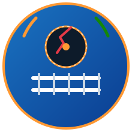
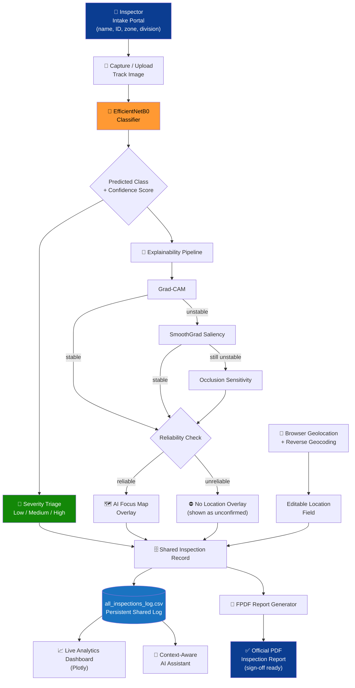

<div align="center">


<br/><br/>



<h1>Bharatiya Rail — Track Fault Detection AI</h1>

<p><strong>AI-powered railway track defect detection, severity triage, and official inspection reporting — built for field engineers.</strong></p>

[](https://www.python.org/)
[](https://streamlit.io/)
[](https://www.tensorflow.org/)
[](./LICENSE)
[](#-author--maintainer)

</div>

---

## 📖 Overview

**Bharatiya Rail — Track Fault Detection AI** is a Streamlit application that lets railway inspection staff upload or capture a photo of a track section and get an instant AI classification of surface defects — **Cracks**, **Flakings**, and **Squats** — complete with:

- automatic severity triage (Low / Medium / High),
- an AI-focus heatmap showing *where* the model based its decision,
- live session and cross-user analytics,
- a context-aware assistant that can answer questions about the current inspection, and
- an official, downloadable PDF inspection report ready for sign-off.

The system is built around a transfer-learning **EfficientNetB0** image classifier and is designed to **support, not replace**, manual inspection by qualified railway engineering personnel. Every prediction the model makes is shown alongside its confidence score and, where reliable, a visual explanation of *why* — so an inspector never has to take the AI's word for it blindly.

---

## ✨ Features

### 🪪 Staff Intake Portal
Captured once per session: inspector name, employee ID, designation, railway zone, and division. This information is carried through to the analytics log and the final PDF report, so every inspection is traceable to the person who performed it.

### 🧠 AI Defect Classification
A three-class EfficientNetB0 classifier distinguishes between:

| Defect | Description | Typical Cause |
|---|---|---|
| **Crack** | Linear surface or sub-surface fracture in the rail | Fatigue, thermal stress, overloading |
| **Flaking** | Thin flakes of metal separating from the rail head | Rolling contact fatigue |
| **Squat** | Localized depression with a dark spot, often crescent-shaped | Repeated wheel–rail contact stress |

Each prediction is automatically mapped to a **severity level** (Low / Medium / High) based on the defect class and the model's confidence score, so inspectors can immediately prioritize which sections need urgent attention.

### 🎯 Exact Part Detected — AI Focus Map
A layered explainability pipeline shows *where* on the track the model focused:

1. **Grad-CAM** — the primary, class-discriminative heatmap.
2. **SmoothGrad saliency** — used as a fallback when Grad-CAM is unstable.
3. **Occlusion sensitivity** — a second fallback for extra confidence.

All of this sits behind a **reliability check**: if the localization signal is weak or inconsistent, the app will *not* present it as a confirmed defect location. This prevents the tool from overstating precision it doesn't actually have.

### 📍 Auto Location Detection
Uses the browser's geolocation API with reverse-geocoding to tag each inspection with a real-world location, which the inspector can review and edit at any time before submitting.

### 📈 Live Analytics Dashboard
A Plotly-powered dashboard covering:
- session-level and cross-user inspection history,
- defect-type and severity breakdowns,
- confidence score trends over time,
- geographic heatmaps of where defects are being found.

### 🤖 Context-Aware AI Assistant
An in-app assistant that can answer questions about defect types, the severity-mapping rules, the model's performance metrics, and the details of the current session — without leaving the app.

### 📄 Official PDF Inspection Reports
A multi-section report generated with FPDF, including:
- inspector and location details,
- the uploaded image and detection result,
- confidence score and AI focus map (when reliable),
- recommended action based on severity,
- a formal sign-off section for the inspecting officer.

### 🗄 Persistent Shared Log
Every inspection, from every user and session, is appended to a server-side CSV log (`all_inspections_log.csv`), which powers the cross-user analytics dashboard and provides a durable audit trail.

---

## 🖥 Tech Stack

| Layer | Technology |
|---|---|
| UI / App Framework | Streamlit (custom glassmorphism theme) |
| Model | EfficientNetB0 (Transfer Learning, TensorFlow / Keras) |
| Explainability | Grad-CAM → SmoothGrad saliency → Occlusion sensitivity (reliability-gated) |
| Visualization | Plotly (Express + Graph Objects) |
| Reporting | FPDF |
| Data | Pandas, CSV persistence |

---

## 🏗 System Design

The diagram below shows how a single inspection flows through the system, from staff sign-in to the final PDF report, and how the shared log feeds the analytics dashboard and the AI assistant.



**Flow summary:**

1. **Intake** — the inspector's identity and posting details are captured once per session.
2. **Capture → Classify** — the uploaded image is run through the EfficientNetB0 classifier to get a defect class and confidence score.
3. **Triage** — class + confidence are mapped to a severity level.
4. **Explain (gated)** — Grad-CAM is tried first; if unstable, the pipeline falls back to SmoothGrad, then occlusion sensitivity. A reliability check decides whether the resulting heatmap is shown at all.
5. **Locate** — geolocation and reverse-geocoding suggest a location, which the inspector can edit.
6. **Persist** — the full record (inspector, image, class, severity, focus map status, location) is appended to the shared CSV log.
7. **Consume** — the log simultaneously feeds the live analytics dashboard, the context-aware AI assistant, and the PDF report generator, which produces the final sign-off-ready document.

---

## 🧭 How It Works, End to End

1. **Sign in** — the inspector fills out the intake portal (name, ID, designation, zone, division).
2. **Capture or upload** — a photo of the track section is submitted.
3. **Classify** — EfficientNetB0 predicts the defect class and confidence score.
4. **Triage** — the class and confidence are mapped to a Low / Medium / High severity.
5. **Explain** — if the reliability check passes, an AI focus map is generated and overlaid on the image.
6. **Locate** — the app auto-detects and reverse-geocodes the inspection location (editable).
7. **Log** — the full record is appended to the shared CSV log and reflected in the analytics dashboard.
8. **Report** — the inspector downloads a formal PDF report, ready for sign-off and, if needed, escalation.

---

## 🚀 Getting Started

### Prerequisites
- Python 3.10+
- A trained model file: `railway_track_detection_final.h5` in the project root

### Installation

```bash
git clone https://github.com/<your-org>/bharatiya-rail-track-fault-ai.git
cd bharatiya-rail-track-fault-ai
pip install -r requirements.txt
```

### Run

```bash
streamlit run app.py
```

The app will open at `http://localhost:8501`.

---

## 📂 Project Structure

```
bharatiya-rail-track-fault-ai/
├── app.py                             # Main Streamlit application
├── railway_track_detection_final.h5   # Trained EfficientNetB0 model (not committed)
├── assets/
│   ├── banner.svg                     # Animated repo banner
│   └── logo.svg                       # Animated project emblem
├── report_images/                     # Auto-generated inspection photos (runtime)
├── all_inspections_log.csv            # Shared master inspection log (runtime)
├── requirements.txt
└── README.md
```

---

## ⚠ Disclaimer

This system is an **AI-assisted decision-support tool**. It is intended to **support, not replace**, manual inspection and verification by qualified railway engineering personnel. Any **High severity** finding must be cross-verified on-site before resuming train operations.

---

## 🤝 Contributing

Contributions, issues, and feature requests are welcome. If you'd like to help improve the model, the explainability pipeline, or the reporting workflow, please open an issue first to discuss what you'd like to change, then submit a pull request.

---

## 📜 License

Released under the [MIT License](./LICENSE).

---

## 👤 Author & Maintainer

<div align="center">

**Created and maintained by [Biswajit Pattanaik](https://github.com/)**

*Contributions, issues, and feature requests are welcome — feel free to open a PR or issue.*

</div>
